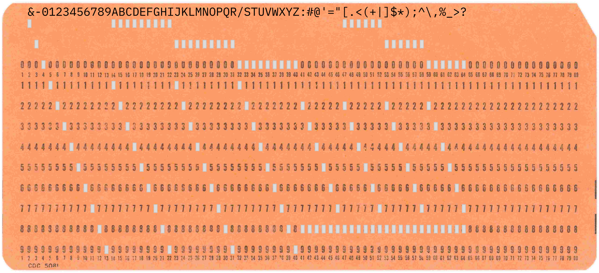

# pun1442

Punch a text file to PDF in IBM 1442 retro style. The punched cards in the PDF file can be read in again with the project rdr1442.

Examples of what can be done with pun1442 can be found at https://github.com/Pynckels/pun1442/tree/main/tests/testOut

The commands to create the examples can be found at https://github.com/Pynckels/pun1442/blob/main/tests/runtests.sh

### Note

This is a work in progress, constructive comments are appreciated.

### Installing

#### Linux

The easiest way to install pun1442 is as follows.

    cd ~
    git clone https://github.com/Pynckels/pun1442.git
    pip install -r ./pun1442/requirements.txt
    chmod +x ./pun1442/pun1442

#### Mac & Windows

Contact me and we'll cook something up together.

### Syntax

To get the command line syntax the -h and the --help option can be used.

    ~/pun1442/pun1442 --help

This results in the following information.

    usage: pun1442 [-h] [-c {BEIGE,BLUE,GREEN,PINK,YELLOW}] [-o <Output file>] [-v] [-y] <Input file>

    Print a text file to PDF in IBM 1403 retro style

    positional arguments:
      <Input file>          File to process or - for stdin.

    options:
      -h, --help            show this help message and exit
      -c, --color {BEIGE,BLUE,GREEN,PINK,YELLOW}
                            Color of cards.
      -o, --outfile <Output file>
                            Output file name or - for stdout.
      -v, --version         Show program version and exit.
      -y, --overwrite       Overwrite output file.

### License

Copyright (c) 2025 by Filip Pynckels

This file is part of the pun1442 project that can be found at
https://github.com/Pynckels/pun1442

pun1442 is free software: you can redistribute it and/or modify
it under the terms of the GNU General Public License as published by
the Free Software Foundation, either version 3 of the License, or
(at your option) any later version.

pun1442 is distributed in the hope that it will be useful,
but WITHOUT ANY WARRANTY; without even the implied warranty of
MERCHANTABILITY or FITNESS FOR A PARTICULAR PURPOSE. See the
GNU General Public License for more details.

You should have received a copy of the GNU General Public License
along with prt1403. If not, see <https://www.gnu.org/licenses/>.

### Acknowledgements

***IBM font*** : This project uses the IBMPlexMono-Regular font. It is licensed under IBMPlexMono-Regular.license

***Punched Cards*** : This project uses the Control Data Corporation 5081 made available on the website of the University of Iowa (Department of Computer Science) as part of the Punched Card Collection by Douglas W. Jones : https://homepage.divms.uiowa.edu/~jones/cards/collection/i-onefield.shtml#CDC5081
